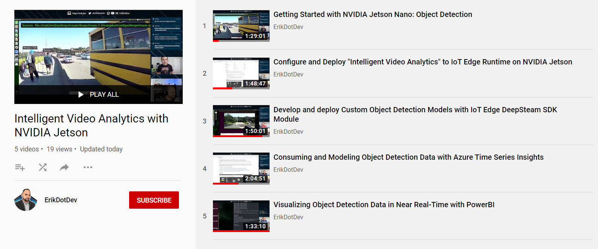
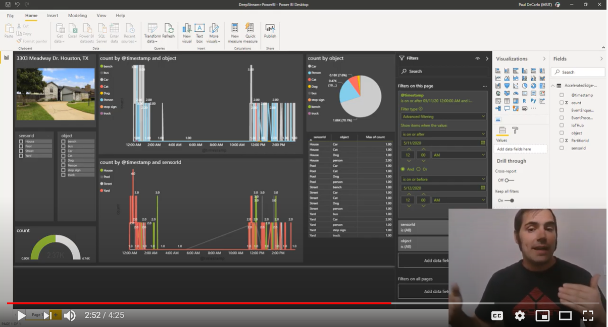
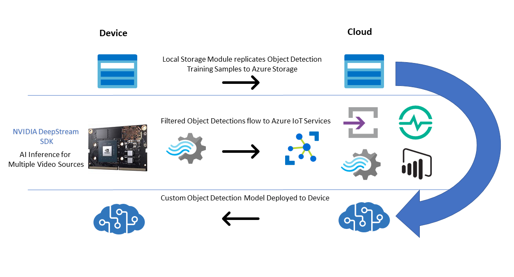
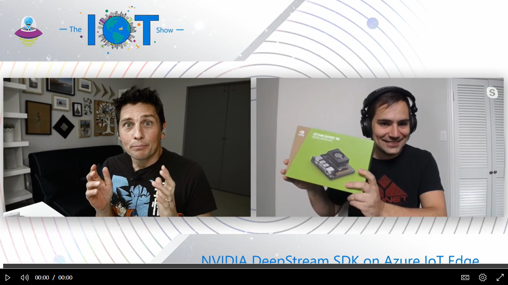

## Intelligent-Video-Analytics-with-NVIDIA-Jetson-and-Microsoft-Azure

A repository demonstrating an end-to-end architecture for Intelligent Video Analytics using NVIDIA hardware with Microsoft Azure.  

This project contains a collection of self-paced learning modules which guide the user in developing a custom Intelligent Video Analytics application that can handle a variety of video input sources, leverage a custom object detection model, and provide backing cloud services for analysis and reporting.  

* [Module 1 - Introduction to NVIDIA DeepStream](./docs/Module%201%20-%20Introduction%20to%20NVIDIA%20DeepStream.md)
* [Module 2 - Configure and Deploy "Intelligent Video Analytics" to IoT Edge Runtime on NVIDIA Jetson](./docs/Module%202%20-%20Configure%20and%20Deploy%20Intelligent%20Video%20Analytics%20to%20IoT%20Edge%20Runtime%20on%20NVIDIA%20Jetson.md)
* [Module 3 - Develop and deploy Custom Object Detection Models with IoT Edge DeepStream SDK Module](./docs/Module%203%20-%20Develop%20and%20deploy%20Custom%20Object%20Detection%20Models%20with%20IoT%20Edge%20DeepStream%20SDK%20Module.md)
* [Module 4 - Filtering Telemetry with Azure Stream Analytics at the Edge and Modeling with Azure Time Series Insights](./docs/Module%204%20-%20Filtering%20Telemetry%20with%20Azure%20Stream%20Analytics%20at%20the%20Edge%20and%20Modeling%20with%20Azure%20Time%20Series%20Insights.md)
* [Module 5 - Visualizing Object Detection Data in Near Real-Time with PowerBI](./docs/Module%205%20-%20Visualizing%20Object%20Detection%20Data%20in%20Near%20Real-Time%20with%20PowerBI.md)

Each of these modules is accompanied by a LiveStream that walks through the steps to reproduce in full detail.  You can watch a build out of the entire project from the ground up by checking out the following [5-part video playlist](https://www.youtube.com/playlist?list=PLzgEG9tLG-1QLc-DPPABoW1YWFMPNQl4t) on Youtube.

## Overview

The project makes use of the [NVIDIA DeepStream SDK](https://azuremarketplace.microsoft.com/en-us/marketplace/apps/nvidia.deepstream-iot?tab=Overview&WT.mc_id=julyot-iva-pdecarlo) running on [NVIDIA Jetson Embedded hardware](https://www.nvidia.com/en-us/autonomous-machines/jetson-store/) to produce an Intelligent Video Analytics Pipeline. 

The solution employs a number of modules that run on the NVIDIA hardware device which are instrumented using the [Azure IoT Edge](https://azure.microsoft.com/en-us/services/iot-edge/?WT.mc_id=julyot-iva-pdecarlo) runtime.  These modules include the [Azure Blob Storage on IoT Edge Module](https://docs.microsoft.com/en-us/azure/iot-edge/how-to-deploy-blob?WT.mc_id=julyot-iva-pdecarlo) for capturing and mirroring object detection training samples to the cloud via a paired [Camera Tagging Module](https://dev.to/azure/introduction-to-the-azure-iot-edge-camera-tagging-module-di8).  These captured samples are then used to train a custom object detection model with the [Custom Vision AI](https://www.customvision.ai/?WT.mc_id=julyot-iva-pdecarlo) offering from [Azure Cognitive Services](https://docs.microsoft.com/en-us/azure/cognitive-services/?WT.mc_id=julyot-iva-pdecarlo). Models generated by this service are leveraged by the DeepStream SDK module using a [Custom Yolo Parser](https://github.com/toolboc/Intelligent-Video-Analytics-with-NVIDIA-Jetson-and-Microsoft-Azure/tree/master/services/DEEPSTREAM/YoloParser/CustomVision_DeepStream5.0_JetPack4.4).  

As object detections are produced by the DeepStream SDK, they are filtered using an [Azure Stream Analytics on Edge Job](https://docs.microsoft.com/en-us/azure/stream-analytics/stream-analytics-edge?WT.mc_id=julyot-iva-pdecarlo) that transforms the output into summarized detections.  These object detection results are then transmitted to an [Azure IoT Hub](https://docs.microsoft.com/en-us/azure/iot-hub/?WT.mc_id=julyot-iva-pdecarlo) where they can be forwarded to additional cloud services for processing and reporting.  

The cloud services employed include [Time Series Insights](https://docs.microsoft.com/en-us/azure/time-series-insights/?WT.mc_id=julyot-iva-pdecarlo), which is a fully managed event processing service for analyzing data over time.  We also demonstrate how to forward object detection data to a [PowerBI](https://docs.microsoft.com/en-us/power-bi/?WT.mc_id=julyot-iva-pdecarlo) dataset for live visualization of results within PowerBI Reports and Dashboards.

For more details on how this all works under the hood, check out this episode of the [IoT Show](https://channel9.msdn.com/Shows/Internet-of-Things-Show) where we cover these capabilities and associated services in depth:

## Prerequisites

Hardware:
* [NVIDIA Jetson Embedded Device](https://www.nvidia.com/en-us/autonomous-machines/jetson-store/) running [JetPack 4.4 Developer Preview](https://developer.nvidia.com/jetpack-sdk-44-dp-archive)
* A [cooling fan](https://amzn.to/2ZI2ki9) installed on or pointed at the Nvidia Jetson Nano device 
* RTSP Capable Camera (Optional)
  - Note: We recommend the [FI9821P from Foscam](https://amzn.to/2XzBRFC) 
* USB Webcam (Optional) 
  - Note: If using a [Jetson Nano](https://amzn.to/2WFE5zF), the power consumption will require that your device is configured to use a [5V/4A barrel adapter](https://amzn.to/32DFsTq) as mentioned [here](https://www.jetsonhacks.com/2019/04/10/jetson-nano-use-more-power/) with an [Open-CV compatible camera](https://web.archive.org/web/20120815172655/http://opencv.willowgarage.com/wiki/Welcome/OS/).

Development Environment:
- [Visual Studio Code (VSCode)](https://code.visualstudio.com/Download?WT.mc_id=github-IntelligentEdgeHOL-pdecarlo)
    - Note: ARM64 builds of VSCode are not officially supported, however, it is possible to install and run the Development Tools on your NVIDIA Jetson Device.  This is not recommended on Jetson Nano hardware due to resource limitations. Consult this article on [Getting Started with IoT Edge Development on Nvidia Jetson Devices](https://dev.to/azure/getting-started-with-iot-edge-development-on-nvidia-jetson-devices-2dfl) for more details.
- Visual Studio Code Extensions
  - [Azure IoT Tools Extension](https://marketplace.visualstudio.com/items?itemName=vsciot-vscode.azure-iot-tools)
- Git tool(s)  
  [Git command line](https://git-scm.com/) 

Cloud Services:
- An Active [Microsoft Azure Subscription](https://azure.microsoft.com/en-us/get-started?WT.mc_id=julyot-iva-pdecarlo)

## Learn more, get certified

If you are interested in learning more about building solutions with Azure IoT Services, check out the following free learning resources:

* [IoT learning paths on Microsoft Learn](https://docs.microsoft.com/learn/browse/?term=IOT&WT.mc_id=julyot-iva-pdecarlo)
* [The IoT show on Channel9](https://channel9.msdn.com/Shows/Internet-of-Things-Show/?WT.mc_id=julyot-iva-pdecarlo)

Once you have upskilled as an IoT developer, make it official with the [AZ-220 Azure IoT Developer certification](https://docs.microsoft.com/learn/certifications/azure-iot-developer-specialty?WT.mc_id=julyot-iva-pdecarlo).
