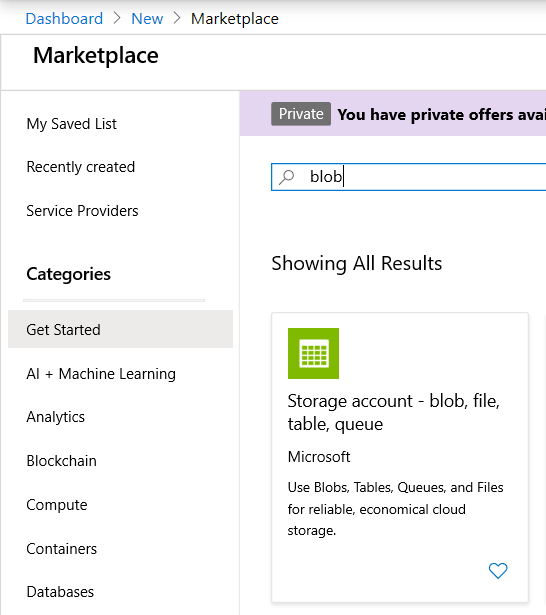
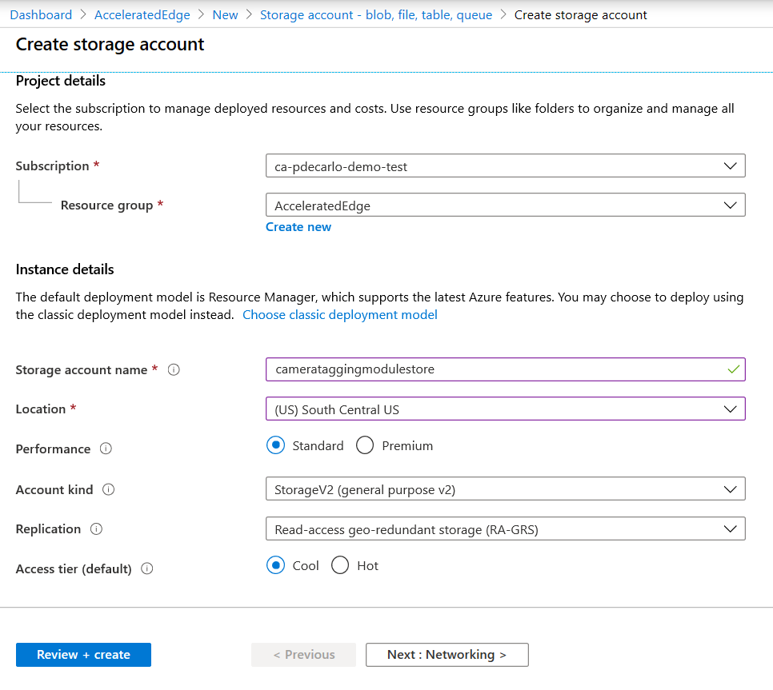

## Intelligent-Video-Analytics-with-NVIDIA-Jetson-and-Microsoft-Azure

A repository demonstrating an end-to-end architecture for Intelligent Video Analytics using NVIDIA hardware with Microsoft Azure

## Introduction

[](
https://www.youtube.com/watch?v=-DWrxUITSbc)


The project makes use of the [NVIDIA DeepStream SDK](https://azuremarketplace.microsoft.com/en-us/marketplace/apps/nvidia.deepstream-iot?tab=Overview&WT.mc_id=julyot-iva-pdecarlo) running on [NVIDIA Jetson Embedded hardware](https://www.nvidia.com/en-us/autonomous-machines/jetson-store/) to produce an Intelligent Video Analytics Pipeline. 

The solution employs a number of modules that run on the NVIDIA hardware device which are instrumented using the [Azure IoT Edge](https://azure.microsoft.com/en-us/services/iot-edge/?WT.mc_id=julyot-iva-pdecarlo) runtime.  These modules include the [Azure Blog Storage on IoT Edge Module](https://docs.microsoft.com/en-us/azure/iot-edge/how-to-deploy-blob?WT.mc_id=julyot-iva-pdecarlo) for capturing and mirroring object detection training samples to the cloud via a paired [Camera Tagging Module](https://dev.to/azure/introduction-to-the-azure-iot-edge-camera-tagging-module-di8).  These captured samples are then used to train a custom object detection model with the [Custom Vision AI](https://www.customvision.ai/?WT.mc_id=julyot-iva-pdecarlo) offering from [Azure Cognitive Services](https://docs.microsoft.com/en-us/azure/cognitive-services/?WT.mc_id=julyot-iva-pdecarlo). Models generated by this service are leveraged by the DeepStream SDK module using a [Custom Yolo Parser](https://github.com/toolboc/Intelligent-Video-Analytics-with-NVIDIA-Jetson-and-Microsoft-Azure/tree/master/services/DEEPSTREAM/YoloParser/CustomVision_DeepStream5.0_JetPack4.4).  

As object detections are produced by the DeepStream SDK, they are filtered using an [Azure Stream Analytics on Edge Job](https://docs.microsoft.com/en-us/azure/stream-analytics/stream-analytics-edge?WT.mc_id=julyot-iva-pdecarlo) that transforms the output into summarized detections.  These object detection results are then transmitted to an [Azure IoT Hub](https://docs.microsoft.com/en-us/azure/iot-hub/?WT.mc_id=julyot-iva-pdecarlo) where they can be forwarded to additional cloud services for processing and reporting.  

The cloud services employed include [Time Series Insights](https://docs.microsoft.com/en-us/azure/time-series-insights/?WT.mc_id=julyot-iva-pdecarlo), which is a fully managed event processing service for analyzing data over time.  We also demonstrate how to forward object detection data to a [PowerBI](https://docs.microsoft.com/en-us/power-bi/?WT.mc_id=julyot-iva-pdecarlo) dataset for live visualization of results within PowerBI Reports and Dashboards.


For more details on how this all works under the hood, check out this episode of the [IoT Show](https://channel9.msdn.com/Shows/Internet-of-Things-Show) where we cover these capabilities and associated services in depth:

[](
https://www.youtube.com/watch?v=EiB1j0FZjgU)

## Prerequisites

Hardware:
* [NVIDIA Jetson Embedded Device](https://www.nvidia.com/en-us/autonomous-machines/jetson-store/) running [JetPack 4.4](https://developer.nvidia.com/embedded/jetpack)
* A [cooling fan](https://amzn.to/2ZI2ki9) installed on or pointed at the Nvidia Jetson Nano device 
* RTSP Capable Camera (Optional)
  - Note: We recommend the [FI9821P from Foscam](https://amzn.to/2XzBRFC) 
* USB Webcam (Optional) 
  - Note: If using a [Jetson Nano](https://amzn.to/2WFE5zF), the power consumption will require that your device is configured to use a [5V/4A barrel adapter](https://amzn.to/32DFsTq) as mentioned [here](https://www.jetsonhacks.com/2019/04/10/jetson-nano-use-more-power/) with an [Open-CV compatible camera](https://web.archive.org/web/20120815172655/http://opencv.willowgarage.com/wiki/Welcome/OS/).

Development Environment:
- [Visual Studio Code (VSCode)](https://code.visualstudio.com/Download?WT.mc_id=github-IntelligentEdgeHOL-pdecarlo)
    - Note: ARM64 builds of VSCode are not officially supported, however, it is possible to install and run the Development Tools on your NVIDIA Jetson Device.  This is not recommended on Jetson Nano hardware due to resource limitations. Consult this article on [Getting Started with IoT Edge Development on Nvidia Jetson Devices](https://dev.to/azure/getting-started-with-iot-edge-development-on-nvidia-jetson-devices-2dfl) for more details.
- Visual Studio Code Extensions
  - [Azure IoT Tools Extension](https://marketplace.visualstudio.com/items?itemName=vsciot-vscode.azure-iot-tools)
- Git tool(s)  
  [Git command line](https://git-scm.com/) 

Cloud Services:
- An Active [Microsoft Azure Subscription](https://azure.microsoft.com/en-us/get-started?WT.mc_id=julyot-iva-pdecarlo)

## Section 1 : Introduction to NVIDIA DeepStream

The [NVIDIA DeepStream SDK](https://developer.nvidia.com/deepstream-sdk) delivers a complete streaming analytics toolkit for AI based video and image understanding and multi-sensor processing. DeepStream SDK features hardware-accelerated building blocks, called plugins that bring deep neural networks and other complex processing tasks into a stream processing pipeline.

The deepstream offering contains the DeepStream SDK which include an app (deepstream-test5) that is configurable to handle multiple streams and multiple networks for inference. The app can be connected to the [Azure IoT Edge runtime](https://docs.microsoft.com/en-us/azure/iot-edge/about-iot-edg?WT.mc_id=julyot-iva-pdecarlo) to send messages to a configured [Azure IoT Hub](https://docs.microsoft.com/en-us/azure/iot-hub/?WT.mc_id=julyot-iva-pdecarlo). 

The [DeepStream SDK is offered in the Azure Marketplace](https://azuremarketplace.microsoft.com/en-us/marketplace/apps/nvidia.deepstream-iot?WT.mc_id=julyot-iva-pdecarlo) as an [IoT Edge Module](https://docs.microsoft.com/en-us/azure/iot-edge/quickstart-linux?WT.mc_id=julyot-iva-pdecarlo).  We will employ this mechanism to configure and run a DeepStream workload on an NVIDIA embedded device.

Before continuing, it is highly suggested to familiarize with the [DeepStream SDK Documentation](http://aka.ms/deepstreamdevguide), as it will provide you with the details on how to customize the Intelligent Video Analytics solution to your needs.

We cover pretty much everything you need to know in this 90 minute livestream titled "[Getting Started with NVIDIA Jetson: Object Detection](https://www.twitch.tv/videos/633625822)".  We highly recommend that you give a watch before proceeding to the next section.

[](
https://www.twitch.tv/videos/633625822)

## Section 2 : Configure and Deploy "Intelligent Video Analytics" to IoT Edge Runtime on NVIDIA Jetson

In this section we will install and configure the IoT Edge Runtime on an NVIDIA Jetson Device.  This will require that we deploy a collection of Azure Services to support the modules that are defined in the associated [IoT Edge Deployment for IoT Hub](https://github.com/toolboc/Intelligent-Video-Analytics-with-NVIDIA-Jetson-and-Microsoft-Azure/blob/master/deployment-iothub/deployment.template.json).

If you take a close look at the deployment, you will notice that it includes the following modules:

| Module                    | Purpose                                                                                                                         | Backing Azure Service                                                    |
|---------------------------|---------------------------------------------------------------------------------------------------------------------------------|--------------------------------------------------------------------------|
| edgeAgent                 | System Module used by IoT Edge to deploy and ensure uptime of modules defined in device deployment                              | [Azure IoT Hub](https://docs.microsoft.com/en-us/azure/iot-hub/?WT.mc_id=julyot-iva-pdecarlo) (Authorization and for obtaining deployment configuration) |
| edgeHub                   | System Module responsible for inter-module communication and message back to Azure IoT Hub                                       | [Azure IoT Hub](https://docs.microsoft.com/en-us/azure/iot-hub/?WT.mc_id=julyot-iva-pdecarlo) (Ingestion of Device to Cloud Telemetry)                   |
| NVIDIADeepStreamSDK       | Custom Module which runs DeepStream workload, output is forwarded to DeepStreamAnalytics Module for summarization               | Telemetry is routed to DeepStreamAnalytics module (see: [IoT Edge - Declare Routes](https://docs.microsoft.com/en-us/azure/iot-edge/module-composition#declare-routes?WT.mc_id=julyot-iva-pdecarlo)) where it is filtered and forwarded to an [Azure IoT Hub](https://docs.microsoft.com/en-us/azure/iot-hub/?WT.mc_id=julyot-iva-pdecarlo)                                                                     |
| CameraTaggingModule       | Custom Module for obtaining images from available RTSP sources for use in Training Custom Object Detection Models               | [CustomVision.AI](https://www.customvision.ai/?WT.mc_id=julyot-iva-pdecarlo) for exporting of captured images for use in training Custom Object Detection model(s)                        |
| azureblobstorageoniotedge | Custom Module for providing replication of data to a backing Azure Storage Account                                              | [Azure Storage Account](https://docs.microsoft.com/en-us/azure/storage/?WT.mc_id=julyot-iva-pdecarlo) for replication and long-term storage of captured images   |
| DeepStreamAnalytics       | Custom Module that employs "Stream Analytics on IoT Edge" Module to Summarize Object Detection Results from NVIDIADeepStreamSDK | [Azure Stream Analytics on Edge](https://docs.microsoft.com/en-us/azure/stream-analytics/stream-analytics-edge?WT.mc_id=julyot-iva-pdecarlo) Job defined and served from Azure                                   |

In this section, we will only need to deploy an [Azure IoT Hub](https://docs.microsoft.com/en-us/azure/iot-hub/?WT.mc_id=julyot-iva-pdecarlo) and [Azure Storage Account](https://docs.microsoft.com/en-us/azure/storage/?WT.mc_id=julyot-iva-pdecarlo). If you are curious about the pricing involved for these services, they are summarized below:

* [IoT Hub Pricing](https://azure.microsoft.com/en-us/pricing/details/iot-hub/?WT.mc_id=julyot-iva-pdecarlo)
* [Azure Storage Account](https://github.com/toolboc/Intelligent-Video-Analytics-with-NVIDIA-Jetson-and-Microsoft-Azure?WT.mc_id=julyot-iva-pdecarlo)
* [Azure Stream Analytics on Edge Pricing](https://azure.microsoft.com/en-us/pricing/details/stream-analytics/?WT.mc_id=julyot-iva-pdecarlo) (Technically, even though we are using a job that is not contained in the end-users subscription, billing does occur per device that runs the DeepStreamAnalytics Module)

The additional services, [CustomVision.AI](https://www.customvision.ai/?WT.mc_id=julyot-iva-pdecarlo) and [Azure Stream Analytics on Edge](https://docs.microsoft.com/en-us/azure/stream-analytics/stream-analytics-edge?WT.mc_id=julyot-iva-pdecarlo), will be addressed in upcoming sections and will not be needed at this time.  

### Section 2.1 : Install IoT Edge onto the Jetson  Device

Before we install IoT Edge, we need to install a few utilities onto the Nvidia Jetson device with:

```
sudo apt-get install -y curl nano 
```

ARM64 builds of IoT Edge that are compatible with NVIDIA Jetson Hardware are provided beginning in the [1.0.8 release tag](https://github.com/Azure/azure-iotedge/releases/tag/1.0.8) of IoT Edge.  To install the latest release of IoT Edge, run the following from a terminal on your Nvidia Jetson device or consult the [official documentation](https://docs.microsoft.com/en-us/azure/iot-edge/how-to-install-iot-edge-linux?WT.mc_id=julyot-iva-pdecarlo):

```
# You can copy the entire text from this code block and 
# paste in terminal. The comment lines will be ignored.

# Install the IoT Edge repository configuration
curl https://packages.microsoft.com/config/ubuntu/18.04/multiarch/prod.list > ./microsoft-prod.list

# Copy the generated list
sudo cp ./microsoft-prod.list /etc/apt/sources.list.d/

# Install the Microsoft GPG public key
curl https://packages.microsoft.com/keys/microsoft.asc | gpg --dearmor > microsoft.gpg
sudo cp ./microsoft.gpg /etc/apt/trusted.gpg.d/

# Perform apt update
sudo apt-get update

# Install IoT Edge and the Security Daemon
sudo apt-get install iotedge

```

After installation, you will receive the following message indicating the need to update the device's configuration, we'll address this in the next step:

```
===============================================================================

                              Azure IoT Edge

  IMPORTANT: Please update the configuration file located at:

    /etc/iotedge/config.yaml

  with your device's provisioning information. You will need to restart the
  'iotedge' service for these changes to take effect.

  To restart the 'iotedge' service, use:

    'systemctl restart iotedge'

    - OR -

    /etc/init.d/iotedge restart

  These commands may need to be run with sudo depending on your environment.

===============================================================================
```

### Section 2.2 : Provision the IoT Edge Runtime on the Jetson Nano Device

In this section, we will manually provision our Jetson hardware as an IoT Edge device.  To accomplish this, we will need to deploy an active IoT Hub which we will use to register a new IoT Edge device and from there obtain a device connection string that we will allow us to securely authenticate to the IoT Hub instance. 

You can create a new IoT Hub, register an IoT Edge device, and obtain the device connection string needed to accomplish this by following the documentation for [Registering an IoT Edge device in the Azure Portal](https://docs.microsoft.com/en-us/azure/iot-edge/how-to-register-device-portal?WT.mc_id=julyot-iva-pdecarlo) or by [Registering an IoT Edge device with the Azure-CLI](https://docs.microsoft.com/en-us/azure/iot-edge/how-to-register-device-cli?WT.mc_id=julyot-iva-pdecarlo).

Once you have obtained a connection string, open the IoT Edge device configuration file:

```
sudo nano /etc/iotedge/config.yaml
```

Find the provisioning section of the file and uncomment the manual provisioning mode. Update the value of `device_connection_string` with the connection string from your IoT Edge device.

```
provisioning:
  source: "manual"
  device_connection_string: "<ADD DEVICE CONNECTION STRING HERE>"
  
# provisioning: 
#   source: "dps"
#   global_endpoint: "https://global.azure-devices-provisioning.net"
#   scope_id: "{scope_id}"
#   registration_id: "{registration_id}"

```

After you have updated the value of `device_connection_string`, restart the iotedge service with:

```
sudo service iotedge restart
```

You can check the status of the IoT Edge Daemon using:

```
systemctl status iotedge
```

Examine daemon logs using:
```
journalctl -u iotedge --no-pager --no-full
```

And, list running modules with:

```
sudo iotedge list
```

To ensure that the IoT Edge Runtime is configured and running:

```
sudo service iotedge status
```

A successfully configured device should report output similar to the following, if there are any errors, double-check the configuration has been set appropriately:

```
● iotedge.service - Azure IoT Edge daemon
   Loaded: loaded (/lib/systemd/system/iotedge.service; enabled; vendor preset: enabled)
   Active: active (running) since Mon 2020-06-08 13:04:44 CDT; 15s ago
     Docs: man:iotedged(8)
 Main PID: 9029 (iotedged)
    Tasks: 11 (limit: 4183)
   CGroup: /system.slice/iotedge.service
           └─9029 /usr/bin/iotedged -c /etc/iotedge/config.yaml
```

The IoT Edge runtime will begin pulling down the edgeAgent and edgeHub system modules.  These modules will run by default until we supply a deployment configuration containing additional modules.

### Section 2.3 : Prepare the Jetson Device to use the "Intelligent Video Analytics" sample configurations

In this section, we will mirror the sample configurations contained in this repo onto the Jetson device.  This will require that we leverage some very specific paths that are referenced in those configurations, so be sure to follow these steps exactly as they are described.  

We will begin by creating a directory to store the configuration on the Jetson device with:

```
sudo mkdir -p /data/misc/storage
```

Next, we will configure the `/data` directory and all subdirectories to be accessible from a non-privileged user account with:

```
sudo chmod -R 777 /data
```

Next, we will navigate to `/data/misc/storage` with:
```
cd /data/misc/storage
```

Then clone this repository to that directory with:
```
git clone https://github.com/toolboc/Intelligent-Video-Analytics-with-NVIDIA-Jetson-and-Microsoft-Azure.git
```

Next, we need to configure the Jetson OS to allow for access to the X11 Window server from a container by granting local privileges to the X11 socket to the `iotedge` user account.

```
xhost local:iotedge
```

This will activate the privileges for the current logged-in session, but will not persist on reboot. Make the configuration persistent by opening `/etc/profile` for editing with:

```
sudo nano /etc/profile
```

Then append the following text to the very top of that file:
```
xhost local:iotedge
```

On subsequent reboots, the `iotedge` user should now be able to spawn Graphical User Interfaces using the host X11 socket.  This will allow us to view the bounding-box detections of the DeepStreamSDK module while running as an IoT Edge module (i.e. while running as a container).

To make diagnosing potential issues easier, you will also want to enable access to the docker service from your user account.  This can be accomplished with:

```
sudo usermod -aG docker $USER
```

On subsequent login sessions, you will now be able to invoke `docker` command without the need to prepend with `sudo`.

We have successfully prepared the Jetson Device to use the "Intelligent Video Analytics" sample configurations.  Next, we will configure the appropriate prerequisite Azure Storage Account and configuration needed for the Blob Storage Module (azureblobstorageoniotedge).

### Section 2.4 : Configure the Blob Storage Module Dependencies

In this step, we will configure the [IoT Edge Blob Storage Module](https://docs.microsoft.com/en-us/azure/iot-edge/how-to-deploy-blob?WT.mc_id=julyot-iva-pdecarlo) which is used in conjunction with the CameraTaggingModule to store image captures locally and replicate them to the cloud.  Technically, this module is optional and the CameraTaggingModule can upload images directly to the cloud or CustomVision.AI without it, but it gives a more robust solution for the end user that can capture and store images without the need for outbound internet access.  You can learn more about the Camera Tagging Module an it's supporting features in this [in-depth article](https://dev.to/azure/introduction-to-the-azure-iot-edge-camera-tagging-module-di8).

This section will require the use of Visual Studio Code, preferably running on a development machine that is not the Jetson device.  Begin by cloning this repository to your development machine by navigating into the directory of your choosing and running:

```
git clone https://github.com/toolboc/Intelligent-Video-Analytics-with-NVIDIA-Jetson-and-Microsoft-Azure.git
```

Next, Open Visual Studio Code, then select "File => Open Folder" then navigate to and select the newly created "Intelligent-Video-Analytics-with-NVIDIA-Jetson-and-Microsoft-Azure" folder.

 Within the newly opened project, create a file named .env in the `deployment-iothub` folder and supply it with the following contents:

```
CONTAINER_REGISTRY_NAME=
LOCAL_STORAGE_ACCOUNT_KEY=
LOCAL_STORAGE_ACCOUNT_NAME=camerataggingmodulelocal
DESTINATION_STORAGE_NAME=camerataggingmodulecloud
CLOUD_STORAGE_CONNECTION_STRING=
```

This file will will store key/value that are used to replace values in deployment.template.json to produce a working deployment manifest. You will notice these entries in the deployment.template.json are proceeded with the '$' symbol.  This marks them as tokens for replacement during the generation of the deployment manifest.

For now, we will skip the `CONTAINER_REGISTRY_NAME` as that is only needed if you are pulling container images from a private repository.  Since the modules in our deployment are all publicly available, it is not needed at this time.

Produce a value for `LOCAL_STORAGE_ACCOUNT_KEY` by visiting [GeneratePlus](https://generate.plus/en/base64).  This will generate a random base64 encoded string that will be used to configure a secure connection to the local blob storage instance.  You will want to supply the entire result, which should end with two equal signs (*==*).

`LOCAL_STORAGE_ACCOUNT_NAME` is best left as-is, but you are welcome to rename it, provided that it follows the format for naming: The field can contain only lowercase letters and numbers and the name must be between 3 and 24 characters.

`DESTINATION_STORAGE_NAME` is supplied from an assumed-to-exist blob storage container in the Azure Cloud.  You can create this container by performing the following steps:

Navigate to the Azure Marketplace and search for 'blob', then select **Storage Account - blob, file, table, queue**



Create the Storage Account using settings similar to below (note: the **Storage account name** must be globally unique)



Select **Review + Create** => **Create** to deploy the new Storage Account Resource.

Navigate to your newly deployed Storage Account and select **Containers**:


Create a new storage container named "camerataggingmodulecloud" as shown below (the name is important as it matches the value in the .env):


CLOUD_STORAGE_CONNECTION_STRING can be obtained by visiting your newly created Storage Account and selecting **Settings** => **Access Keys**.  Copy the entire contents of the **Connection string** and supply this as the value.


Your completed .env file should look similar to the following:
```
CONTAINER_REGISTRY_NAME=
LOCAL_STORAGE_ACCOUNT_KEY=9LkgJa1ApIsISmuUHwonxg==
LOCAL_STORAGE_ACCOUNT_NAME=camerataggingmodulelocal
DESTINATION_STORAGE_NAME=camerataggingmodulecloud
CLOUD_STORAGE_CONNECTION_STRING=DefaultEndpointsProtocol=https;AccountName=camerataggingmodulestore;AccountKey=00000000000000000000000000000000000000000000000000000000000000000000000000000000000000==;EndpointSuffix=core.windows.net
```

We are now ready to create and apply the sample deployment specified in the`deployment-iothub`.

### Section 2.5 : Generate and Apply the IoT Hub based deployment configuration 

Now that we have accounted for all of the pre-requisite services, setup, and configuration; we are ready to produce a deployment to begin running a sample Intelligent Video Analytics pipeline on our Jetson device.  The following steps will take place in Visual Studio Code, again, preferably running on a development machine which is not the Jetson Device itself.

In the previous section, we created a .env file to support the configuration parameters needed by the Blob Storage Module.  That .env file should be located in the `deployment-iothub` folder.  Ensure that you have supplied the appropriate parameters and that the .env file exists before proceeding.

Next, we will configure the project to target the arm64v8 platform. To accomplish this, bring up the Command Pallette with (CTRL+SHIFT+P), then search for the following task: 

```
Azure IoT Edge: Set Default Target Platform for Edge Solution
```

Select the "Azure IoT Edge: Set Default Target Platform for Edge Solution" task and a drop-down will appear showing all available platforms. Select `arm64v8` from the list.  This will ensure that any modules added to the project and built-from source are targeted to the Jetson architecture.

Note: If you do not see any results when searching for the task above, ensure that you have installed the [Azure IoT Tools Extension](https://marketplace.visualstudio.com/items?itemName=vsciot-vscode.azure-iot-tools).

Bring up the Command Pallette again with (CTRL+SHIFT+P), this time search for:

```
Azure IoT Hub: Select IoT Hub
```

Select the "Azure IoT Hub: Select IoT Hub" task and follow the prompts to connect to the IoT Hub that was used to register and configure the IoT Edge runtime on your Jetson Device.  This may require that you authenticate your Visual Studio Code instance with Microsoft Azure if you have never done so before.

After you have selected the appropriate IoT Hub, expand the `deployment-iothub` folder and right-click the `deployment.template.json` file, then select "Generate IoT Edge Deployment Manifest".  This will produce a new folder in that directory named "config" and an associated deployment named `deployment.arm64v8.json`.  Right-click the `deployment.arm64v8.json` file and select "Create Deployment for Single Device".

A drop-down should appear showing all devices registered in your currently selected IoT Hub.  Choose the device that represents your Jetson Device and the deployment will begin to activate on your device (provided the IoT Edge runtime is active and that the device is connected to the internet).

It may take a while for the images specified in the deployment to pull down to the device.  You can verify that all images are pulled with:

```
sudo docker images
```

A completed deployment should eventually show a result similar to the following output:

```
REPOSITORY                                              TAG                   IMAGE ID            CREATED             SIZE
mcr.microsoft.com/azureiotedge-hub                      1.0                   9b62dd5f824e        7 days ago          237MB
mcr.microsoft.com/azureiotedge-agent                    1.0                   ae9bfb3081c5        7 days ago          219MB
nvcr.io/nvidia/deepstream-l4t                           5.0-dp-20.04-iot      7b4457646f87        5 weeks ago         2.16GB
toolboc/camerataggingmodule                             latest                704e9e0ce6dc        6 weeks ago         666MB
mcr.microsoft.com/azure-stream-analytics/azureiotedge   1.0.6-linux-arm32v7   bb2d6fbc5a3b        4 months ago        566MB
mcr.microsoft.com/azure-blob-storage                    latest                76f2e7849a91        11 months ago       203MB
```

When you are certain that the deployment has completed, it is now possible to modify the solution to your needs.  This will be explained in the next section.

### Section 2.6 : Customizing the Sample Deployment 

This section is a bit open-ended as it will depend on how you intend to process video input on your Jetson Device.  

Before making any modifications, it is highly advised to consult the [DeepStream Documentation for Configuration Groups](http://aka.ms/DeepStreamDevGuide) and remember that everything should be tracked using 'git' so recovery is always possible.  

The un-modified sample deployment references a DeepStream configuration located on your Jetson Device at `/data/misc/storage/Intelligent-Video-Analytics-with-NVIDIA-Jetson-and-Microsoft-Azure/services/DEEPSTREAM/configs`.  Within this directory there will be some additional example DeepStream Configurations:

| DeepStream Sample Configuration Name | Description                                                                                                                                                                                                |
|--------------------------------------|------------------------------------------------------------------------------------------------------------------------------------------------------------------------------------------------------------|
| DSConfig-CustomVisionAI.txt          | Employs an example object detection model created with CustomVision.AI that is located in /data/misc/storage/Intelligent-Video-Analytics-with-NVIDIA-Jetson-and-Microsoft-Azure/services/CUSTOM_VISION_AI  |
| DSConfig-YoloV3.txt                  | Employs an example object detection model based on [YoloV3](https://pjreddie.com/darknet/yolo/)                                                                                                            |
| DSConfig-YoloV3Tiny.txt              | Employs an example object detection model based on [YoloV3Tiny](https://pjreddie.com/darknet/yolo)   

Each of these examples are configured by default to process a single video input from a [publicly available RTSP stream of Big Buck Bunny](https://www.wowza.com/html/mobile.html).  We do this partially because it is the ONLY reliable and publicly accessible RTSP stream on the entire internet and to make it super easy to modify the existing example to point to a custom RTSP endpoint for say, an IP capable security camera.  

To change the active DeepStream configuration in your deployment, you can modify the `deployment.template.json` to specify a different configuration file within the `ENTRYPOINT` specification for the `NVIDIADeepStreamSDK` module, then repeat the steps in section 2.5 to regenerate and apply the modified deployment. Note that using the YoloV3* configurations will require that you bring in some additional dependencies which will be discussed in Section 3.  

In the default deployment that we applied, the DeepStream confiuration, DSConfig-CustomVisionAI.txt can be modified on your Jetson device with:

```
nano /data/misc/storage/Intelligent-Video-Analytics-with-NVIDIA-Jetson-and-Microsoft-Azure/services/DEEPSTREAM/configs/DSConfig-CustomVisionAI.txt
```

After you have made edits to this configuration, restart the NVIDIADeepStreamSDK module to test it with:
```
docker restart NVIDIADeepStreamSDK
```

To monitor the logs, you can use:
```
iotedge logs NVIDIADeepStreamSDK
```

OR

```
docker logs -f NVIDIADeepStreamSDK
```

For each of your input sources, you will want to ensure that each of them is provided an entry in msgconv_config.txt by modifying with:
```
nano /data/misc/storage/Intelligent-Video-Analytics-with-NVIDIA-Jetson-and-Microsoft-Azure/services/DEEPSTREAM/configs/msgconv_config.txt
```

This file is used to generate telemetry to the Azure IoT Hub and to specify which video input / camera that a given object detection originated from.

One last note, if you are modifying the DeepStream configuration to use multiple video sources,you will want to modify the `[streammux]` `batch-size` property to equal the number of video sources you are using for optimal performance.  For example, if you have modified the DeepStream Configuration to use four input RTSP streams, you will want to set `[streammux]` `batch-size` = 4, in your modified DeepStream configuration.

Once you have modified the configuration to obtain video sources from your desired inputs, we will now be ready to look into how to create and deploy Custom Object Detection Model from CustomVision.AI and explore the usage of academic grade models using the YOLOV3* configurations. 

## Section 3 : Customizing the Object Detection Model used for DeepStream Inference

At this point, you should have deployed a custom DeepStream Configuration that is able to consume input from your desired sources.  We will now look into ways to customize the object detection model that is employed in that configuration to enable to you to create a fully customized Intelligent Video Analytics Pipeline.

This section will assume that you might be brand new to the world of Computer Vision / Artificial Intelligence and that you are interested in the end goal of using a Custom Object Detection model that detects objects that you train it to detect, or that you wish to employ an academic-grade object detection model that has been trained on [80 common objects](./services/YOLOV3/labels.txt).