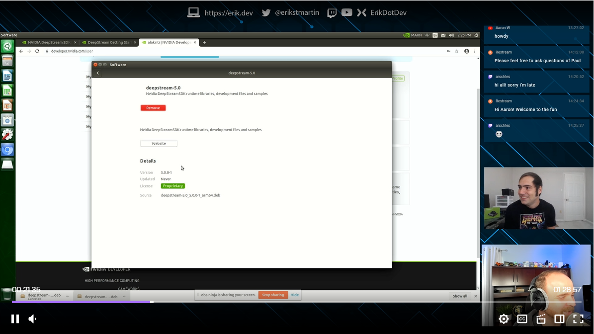

# Intelligent-Video-Analytics-with-NVIDIA-Jetson-and-Microsoft-Azure

A repository demonstrating an end-to-end architecture for Intelligent Video Analytics using NVIDIA hardware with Microsoft Azure

## Introduction

The project makes use of the [NVIDIA DeepStream SDK](https://azuremarketplace.microsoft.com/en-us/marketplace/apps/nvidia.deepstream-iot?tab=Overview&WT.mc_id=julyot-iva-pdecarlo) running on [NVIDIA Jetson Embedded hardware](https://www.nvidia.com/en-us/autonomous-machines/jetson-store/) to produce an Intelligent Video Analytics Pipeline. 

The solution employs a number of modules that run on the NVIDIA hardware device which are instrumented using the [Azure IoT Edge](https://azure.microsoft.com/en-us/services/iot-edge/?WT.mc_id=julyot-iva-pdecarlo) runtime.  These modules include the [Azure Blog Storage on IoT Edge Module](https://docs.microsoft.com/en-us/azure/iot-edge/how-to-deploy-blob?WT.mc_id=julyot-iva-pdecarlo) for capturing and mirroring object detection training samples to the cloud via a paired [Camera Tagging Module](https://dev.to/azure/introduction-to-the-azure-iot-edge-camera-tagging-module-di8).  These captured samples are then used to train a custom object detection model with the [Custom Vision AI](https://www.customvision.ai/?WT.mc_id=julyot-iva-pdecarlo) offering from [Azure Cognitive Services](https://docs.microsoft.com/en-us/azure/cognitive-services/?WT.mc_id=julyot-iva-pdecarlo). Models generated by this service are leveraged by the DeepStream SDK module using a [Custom Yolo Parser](https://github.com/toolboc/Intelligent-Video-Analytics-with-NVIDIA-Jetson-and-Microsoft-Azure/tree/master/services/DEEPSTREAM/YoloParser/CustomVision_DeepStream5.0_JetPack4.4).  

As object detections are produced by the DeepStream SDK, they are filtered using an [Azure Stream Analytics on Edge Job](https://docs.microsoft.com/en-us/azure/stream-analytics/stream-analytics-edge?WT.mc_id=julyot-iva-pdecarlo) that transforms the output into summarized detections.  These object detection results are then transmitted to an [Azure IoT Hub](https://docs.microsoft.com/en-us/azure/iot-hub/?WT.mc_id=julyot-iva-pdecarlo) where they can be forwarded to additional cloud services for processing and reporting.  

The cloud services employed include [Time Series Insights](https://docs.microsoft.com/en-us/azure/time-series-insights/?WT.mc_id=julyot-iva-pdecarlo), which is a fully managed event processing service for analyzing data over time.  We also demonstrate how to forward object detection data to a [PowerBI](https://docs.microsoft.com/en-us/power-bi/?WT.mc_id=julyot-iva-pdecarlo) dataset for live visualization of results within PowerBI Reports and Dashboards.

For more details on how this all works under the hood, check out this episode of the [IoT Show](https://channel9.msdn.com/Shows/Internet-of-Things-Show) where we cover these capabilities and associated services in depth:

## Prerequisites

Hardware:
* [NVIDIA Jetson Embedded Device](https://www.nvidia.com/en-us/autonomous-machines/jetson-store/) running [JetPack 4.4](https://developer.nvidia.com/embedded/jetpack)
* A [cooling fan](https://amzn.to/2ZI2ki9) installed on or pointed at the Nvidia Jetson Nano device 
* USB Webcam (Optional) 
  - Note: If using a [Jetson Nano](https://amzn.to/2WFE5zF), the power consumption will require that your device is configured to use a [5V/4A barrel adapter](https://amzn.to/32DFsTq) as mentioned [here](https://www.jetsonhacks.com/2019/04/10/jetson-nano-use-more-power/) with an [Open-CV compatible camera](https://web.archive.org/web/20120815172655/http://opencv.willowgarage.com/wiki/Welcome/OS/).

Development Environment:
- [Visual Studio Code (VSCode)](https://code.visualstudio.com/Download?WT.mc_id=github-IntelligentEdgeHOL-pdecarlo)
    - Note: ARM64 builds of VSCode are not officially supported, however, it is possible to install and run the Development Tools on your NVIDIA Jetson Device.  This is not recommended on Jetson Nano hardware due to resource limitations. Consult this article on [Getting Started with IoT Edge Development on Nvidia Jetson Devices](https://dev.to/azure/getting-started-with-iot-edge-development-on-nvidia-jetson-devices-2dfl) for more details.
- Visual Studio Code Extensions
  - [Azure IoT Tools Extension](https://marketplace.visualstudio.com/items?itemName=vsciot-vscode.azure-iot-tools)
- Git tool(s)  
  [Git command line](https://git-scm.com/) 

Cloud Services:
- An Active [Microsoft Azure Subscription](https://azure.microsoft.com/en-us/get-started?WT.mc_id=julyot-iva-pdecarlo)

## Section 1 : Introduction to NVIDIA DeepStream

The [NVIDIA DeepStream SDK](https://developer.nvidia.com/deepstream-sdk) delivers a complete streaming analytics toolkit for AI based video and image understanding and multi-sensor processing. DeepStream SDK features hardware-accelerated building blocks, called plugins that bring deep neural networks and other complex processing tasks into a stream processing pipeline.

The deepstream offering contains the DeepStream SDK which include an app (deepstream-test5) that is configurable to handle multiple streams and multiple networks for inference. The app can be connected to the [Azure IoT Edge runtime](https://docs.microsoft.com/en-us/azure/iot-edge/about-iot-edg?WT.mc_id=julyot-iva-pdecarlo) to send messages to a configured [Azure IoT Hub](https://docs.microsoft.com/en-us/azure/iot-hub/?WT.mc_id=julyot-iva-pdecarlo). 

The [DeepStream SDK is offered in the Azure Marketplace](https://azuremarketplace.microsoft.com/en-us/marketplace/apps/nvidia.deepstream-iot?WT.mc_id=julyot-iva-pdecarlo) as an [IoT Edge Module](https://docs.microsoft.com/en-us/azure/iot-edge/quickstart-linux?WT.mc_id=julyot-iva-pdecarlo).  We will employ this mechanism to configure and run a DeepStream workload on an NVIDIA embedded device.

Before continuing, it is highly suggested to familiarize with the [DeepStream SDK Documentation](http://aka.ms/deepstreamdevguide), as it will provide you with the details on how to customize the Intelligent Video Analytics solution to your needs.

We cover pretty much everything you need to know in this 90 minute livestream titled "[Getting Started with NVIDIA Jetson: Object Detection](https://www.twitch.tv/videos/633625822)".  We highly recommend that you give a watch before proceeding to the next section.

## Section 2 : Configure and Deploy "Intelligent Video Analytics" to IoT Edge Runtime on NVIDIA Jetson

In this section we will install and configure the IoT Edge Runtime on an NVIDIA Jetson Device.  This will require that we deploy a collection of Azure Services to support the modules that are defined in the associated [IoT Edge Deployment for IoT Hub](https://github.com/toolboc/Intelligent-Video-Analytics-with-NVIDIA-Jetson-and-Microsoft-Azure/blob/master/deployment-iothub/deployment.template.json).

If you take a close look at the deployment, you will notice that it includes the following modules:

| Module                    | Purpose                                                                                                                         | Backing Azure Service                                                    |
|---------------------------|---------------------------------------------------------------------------------------------------------------------------------|--------------------------------------------------------------------------|
| edgeAgent                 | System Module used by IoT Edge to deploy and ensure uptime of modules defined in device deployment                              | [Azure IoT Hub](https://docs.microsoft.com/en-us/azure/iot-hub/?WT.mc_id=julyot-iva-pdecarlo)(Authorization and for obtaining deployment configuration) |
| edgeHub                   | System Module responsible for inter-module communication and message back to Azure IoT Hub                                       | [Azure IoT Hub](https://docs.microsoft.com/en-us/azure/iot-hub/?WT.mc_id=julyot-iva-pdecarlo) (Ingestion of Device to Cloud Telemetry)                   |
| NVIDIADeepStreamSDK       | Custom Module which runs DeepStream workload, output is forwarded to DeepStreamAnalytics Module for summarization               | N/A                                                                      |
| CameraTaggingModule       | Custom Module for obtaining images from available RTSP sources for use in Training Custom Object Detection Models               | [CustomVision.AI](https://www.customvision.ai/?WT.mc_id=julyot-iva-pdecarlo) for exporting of captured images                         |
| azureblobstorageoniotedge | Custom Module for providing replication of data to a backing Azure Storage Account                                              | [Azure Storage Account](https://docs.microsoft.com/en-us/azure/storage/?WT.mc_id=julyot-iva-pdecarlo) for replication and long-term storage of captured images   |
| DeepStreamAnalytics       | Custom Module that employs "Stream Analytics on IoT Edge" Module to Summarize Object Detection Results from NVIDIADeepStreamSDK | [Azure Stream Analytics on Edge](https://docs.microsoft.com/en-us/azure/stream-analytics/stream-analytics-edge?WT.mc_id=julyot-iva-pdecarlo) Job defined and served from Azure                                   |

In this section, we will only need to deploy an [Azure IoT Hub](https://docs.microsoft.com/en-us/azure/iot-hub/?WT.mc_id=julyot-iva-pdecarlo) and [Azure Storage Account](https://docs.microsoft.com/en-us/azure/storage/?WT.mc_id=julyot-iva-pdecarlo). If you are curious about the pricing involved for these services, they are summarized below:

* [IoT Hub Pricing](https://azure.microsoft.com/en-us/pricing/details/iot-hub/?WT.mc_id=julyot-iva-pdecarlo)
* [Azure Storage Account](https://github.com/toolboc/Intelligent-Video-Analytics-with-NVIDIA-Jetson-and-Microsoft-Azure?WT.mc_id=julyot-iva-pdecarlo)
* [Azure Stream Analytics on Edge Pricing](https://azure.microsoft.com/en-us/pricing/details/stream-analytics/?WT.mc_id=julyot-iva-pdecarlo) (Technically, even though we are using a job that is not contained in the end-users subscription, billing does occur per device that runs the DeepStreamAnalytics Module)

The additional services, [CustomVision.AI](https://www.customvision.ai/?WT.mc_id=julyot-iva-pdecarlo) and [Azure Stream Analytics on Edge](https://docs.microsoft.com/en-us/azure/stream-analytics/stream-analytics-edge?WT.mc_id=julyot-iva-pdecarlo) will be addressed in upcoming sections and will not be needed at this time.  
